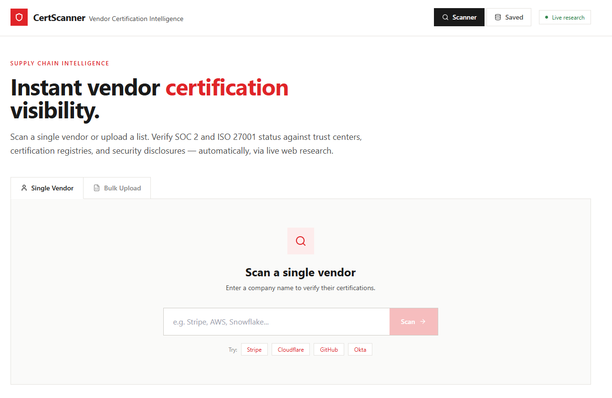
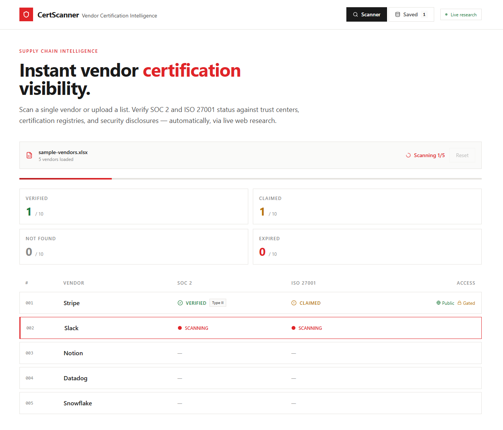
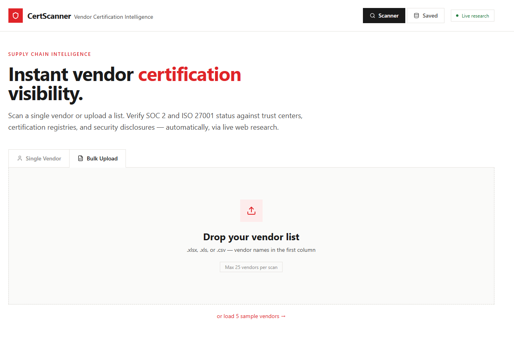
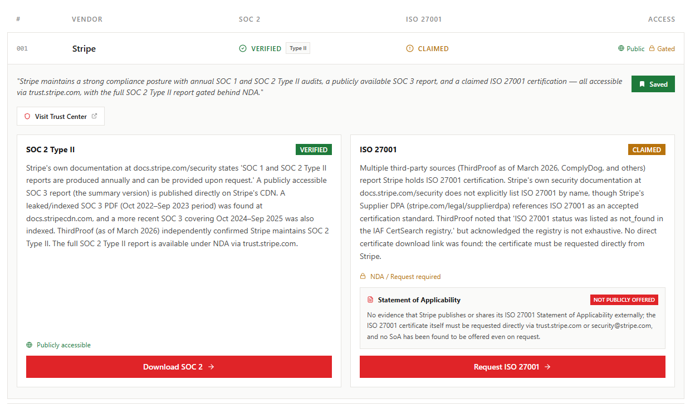

# vendor-cert-scanner

A tool for verifying vendor SOC 2 and ISO 27001 certifications via live web research. Scan a single vendor or upload a bulk list — results include trust center links, access levels, and Statement of Applicability (SoA) availability.

## Features

- **Single vendor** and **bulk upload** modes (Excel/CSV)
- Live API calls with web search via the Anthropic API
- SOC 2 and ISO 27001 status badges: `verified` / `claimed` / `not_found` / `expired`
- Statement of Applicability (SoA) tracking for ISO 27001
- Deep-links to trust portals, not generic marketing pages
- Public vs. NDA-gated access indicators
- Saved vendor library with search, filter, and CSV export

## Screenshots

### Single vendor mode

### Bulk upload mode

### Scan results — expanded view

## Usage

Runs as a Claude.ai artifact — paste `App.jsx` into a new React artifact and it works out of the box. No API key configuration needed when running inside Claude.ai.

## Stack

- React (Claude.ai artifact sandbox)
- Anthropic API (`claude-sonnet-4-20250514`) with `web_search_20250305` tool
- SheetJS for Excel/CSV parsing
- Tailwind CSS + Lucide icons

## Notes

- Max 25 vendors per bulk scan
- Vendor results are auto-saved to artifact persistent storage
- CSV export available after scan completes
